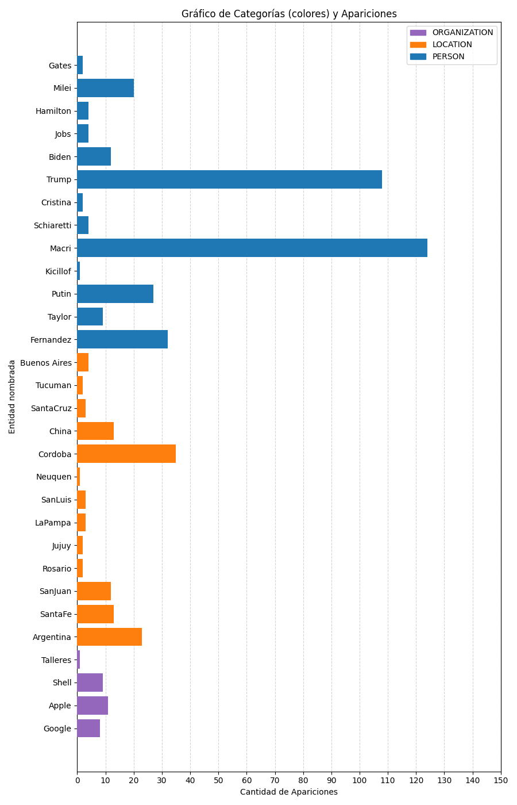

# Laboratorio de Computación Distribuida con Apache Spark (grupo 25)
**Integrantes:** Emilio Pereyra, Ariel Leiva y Camila Nanini
<br>
El **enunciado** del laboratorio se encuentra en [este link](https://docs.google.com/document/d/e/2PACX-1vQn5BpCPQ6jKMN-sz46261Qot82KbDZ1RUx8jNzAN4kBEAq_i97T3R6ZA0_yRA5elN66e-EArXQXuAh/pub).

<h3 align="center" style="margin-bottom: 15px;">¿Cómo se debe ejecutar?</h3>
<h5 align="center"  style="margin-top: 5px; margin-bottom: 14px;">(Mini-documentación)</h5>

&emsp;
Hemos modificado el make para que la ejecución del programa sea más sencilla. Luego de setear algunas variables, solo debemos hacer `make run` y con eso se inicializará todo el entorno necesario para la ejecución, y posteriormente, se ejecutará el programa. Si lo que se quiere es directamente correr el programa, ver <a href="#paso-a-paso">paso a paso</a>, pero aquí dejamos explicada cada parte:
- **Flags:** Para pasar una flag propia del progrma deberemos hacer como en el laboratorio anterior colocando `make run ARGS=""` y dentro de las comillas colocar las flags que vayamos a utilizar.

- **SPARK_PATH:** El valor de la variable `SPARK_PATH` del archivo Makefile debe contener el path donde está el **directorio principal** con los archivos de Spark en nuestra computadora. **NO confundir** este con bin o sbin, debe ser el que los contiene.

- **MVN:** Por defecto, esta variable entiende que Maven está instalado en nuestra computadora y se puede llamar bajo el alias `mvn`. De no ser así se deberá ingresar al makefile y modificar la variable **MVN** colocando el path a la carpeta donde se tenga el **ejecutable** `mvn` (path/to/maven/bin/mvn). Enfatizamos que a diferencia de la variable anterior, esta asume que lo que se coloque es un **ejecutable**, y **NO** un directorio.

- **Configuraciones de los workers:** Podemos cambiar la cantidad de cores y de memoria que utiliza cada worker. Para esto en el makefile existen dos variables, `CANT_CORES`y `CANT_MEMORY`, que respectivamente permiten configurar estas dos características.

- **Cantidad de workers:** Antes de ejecutar, en la terminal debe exportarse la variable de entorno SPARK_WORKER_INSTANCES con el valor deseado (e.g. export SPARK_WORKER_INSTANCES=2). De esta forma el daemon de spark lee cuantos workers debería haber activos para detenerlos y/o iniciarlos.
<br>
<br>
**Tener en cuenta que esto puede povocar problemas:** Si, por ejemplo, se inician 3 workers, estos no son desactivados, y se cambia el valor de la variable SPARK_WORKER_INSTANCES a por ejemplo 2 (sin antes de desactivarlos), al tratar de detener los workers se detienen solo 2 de ellos, pues el daemon de spark cree que son los únicos configurados corriendo. Se pierde referencia del tercero y no puede ser detenido por el daemon. Si este problema ocurre (identificable al ver varios procesos de java sin cerrar), se puede utilizar `pkill java` (o más específicamente `pkill -f org.apache.spark.deploy.worker.Worker`) para forzar el cierre de los workers.

<div id="paso-a-paso"></div>

### Paso a paso:
1. Instalar Maven de forma nativa, o bien setear la variables MVN en el makefile con el ejectuable de Maven, 
que puede descargarse [aquí](https://maven.apache.org/download.cgi).

2. De no tenerlo, [descargar Spark](https://spark.apache.org/downloads.html), y luego setear la variable SPARK_PATH en el Makefile con el directorio raíz que contiene los archivos de Spark.

3. Utilizar el comando `export SPARK_WORKER_INSTANCES=<cantidad de workers deseados>`.

4. Ejecutar ```make run ARGS="<Los argumentos van aqui>"``` (esta parte de la interfaz se mantiene igual a la implementación original de laboratorio 3).


## Detalles para ejecución
&emsp;En un principio tuvimos problemas a la hora de ejecutar la aplicación, pues algunas dependencias de Spark no son compatibles con todas las versiones de Java, así que luego de varios intentos descubrimos que al una versión de Java menor o igual a la 11, funciona. Por ejemplo, con java-jdk 8 sabemos que anda correctamente.
&emsp;En ubuntu esto se puede hacer (una vez instalada la versión deseada) usando el comando <code>update-alternatives --config java</code> y seleccionando el entorno, y en arch usando <code>archlinux-java set <Entorno de java></code>.
## Detalles del clúster en nuestras ejecuciones
&emsp;Para realizar las ejecuciones que se verán en la próxima sección se utilizó una única computadora con las siguientes especificaciones principales:

CPU: Intel Core i5-1235u (10 núcleos, 12 hilos. 2 cores son "de rendimiento", el resto son "de eficiencia")

RAM: 8GB DDR4 a 3200MT/s (sé que podría ser importante, pero yo, usuario de la compu, no encontré mucha información simple sobre las latencias).

&emsp;El driver y cada worker tuvieron disponible 1GiB de memoria RAM y 1 núcleo cada uno.

## Evaluación de archivos con gran tamaño:
&emsp;Aquí presentamos un estudio de ciertos casos de ejecución teniendo en cuenta que se utilizó el archivo de gran tamaño llamado `wiki_dump_parcial.txt` (proveído por la cátedra) al que se le aplicó una identificación y clasificación de entidades nombradas usando la heurística de `Capitalized Words`, ya que la misma era la que más palabras podía detectar (y queríamos ver los límites a los que podíamos llegar). Se guardaron los resultados de estas tres ejecuciones en el directorio de nombre "Resultados de ejecución" por si se desea verificar de algún dato o resultado.

&emsp;Ejecutando el comando `time make run ARGS="-ne cw"`, obtenemos los siguientes tiempos (el primero es el tiempo de compilación que retorna maven, el segundo es el de toda la ejecución, otorgado por el comando time): 

1. *Caso de 1 worker:*

``` bash
[INFO] BUILD SUCCESS
[INFO] ------------------------------------------------------------------------
[INFO] Total time:  2.127 s

.
.
.

real	8m22,054s
user	0m27,806s
sys	    0m2,623s
```

Tiempo de ejecución de la App (tiempo total - tiempo de compilación):&emsp;8m19.927s
<br>
Tiempo *estimado* de ejecución del driver (tiempo de usuario - tiempo de compilación):&emsp;25.183s

2. *Caso de 2 workers:*

``` bash
[INFO] BUILD SUCCESS
[INFO] ------------------------------------------------------------------------
[INFO] Total time:  2.006 s

.
.
.

real	5m30,694s
user	0m29,770s
sys	    0m2,447s
```
Tiempo de ejecución de la App (tiempo total - tiempo de compilación):&emsp;5m28.688s
<br>Tiempo *estimado* de ejecución del driver (tiempo de usuario - tiempo de compilación):&emsp;27.323s


3. *Caso de 4 workers:*

``` bash
[INFO] BUILD SUCCESS
[INFO] ------------------------------------------------------------------------
[INFO] Total time:  2.569 s

.
.
.

real	5m31,385s
user	0m39,391s
sys  	0m3,245s
```

Tiempo de ejecución de la App (tiempo total - tiempo de compilación):&emsp;5m28.816s
<br>Tiempo *estimado* de ejecución del driver (tiempo de usuario - tiempo de compilación):&emsp;36.146s

## Análisis

&emsp;Como se puede ver más arriba, entre la primera ejecución y la segunda, hay un gran cambio, la ejecución de la App fue aproximadamente 1.52 (1 punto 52 veces) veces más rápida en el segundo caso respecto al primero. Esto nos da cierta seguridad de que efectivamente está habiendo un cómputo distribuido entre los workers.

&emsp;Entre el segundo y el tercer caso, vemos algo interesante. El tiempo total fue prácticamente el mismo, aunque si observamos el tiempo estimado de la ejecución del driver, vemos que aumentó aproximadamente un 32%. Lo que problemente sucede es que si bien ahora hay más workers trabajando en paralelo, el tiempo que se ganó gracias a la mayor distribución de cómputo en general, se pierde por el trabajo de procesamiento extra que tiene que hacer el driver para organizar los workers, y sobre todo, recolectar los resultados de los trabajos (notemos que el análisis es siempre sobre el mismo archivo con la misma heurística, por lo que no cambian las entidades nombradas que se someterán al cómputo de estadísticas).

**NOTA:** Realizamos varias veces las mismas ejecuciones, y los tiempos apenas variaron en una cantidad proporcionalmente baja de segundos (el primer caso fue el que más varió). Lo ideal hubiera sido tomar el promedio, pero a falta de tiempo afirmamos que si bien los tiempos no son iguales, el análisis se mantiene válido, y proveemos un archivo más que contiene otra ejecución de los 3 casos ("anotherRun.txt").
<br>
&emsp;También verificamos si los tiempos de inicialización de los workers afectaban al tiempo de user, y resulta que no, por lo que no afectan al análisis sobre esta métrica.

## ¿Qué se está computando distribuidamente?
&emsp;Hay dos funciones principales del proyecto que suceden de forma distribuida: uno es el proceso de utilizar la heurística para descubrir las entidades nombradas en los feeds descargados; y la clasificación de las entidades halladas en los grupos categóricos correspondientes. No adaptamos el cómputo de estadísticas para que se realice de manera distribuída.

## Cambios de clases/métodos
&emsp;Tuvimos que realizar un cambio en un método que utilizabamos anteriormente llamado rawClassify, y pasamos a utilizar uno que se llama distributedRawClassify. Esto fue necesario pues para archivos de gran tamaño, ciertas heurísticas generaban un array con demasiados elementos como para recolectar los datos y computar posteriormente las estadísticas, por lo que tomamos la decisión de que todos aquellos elementos que no se encuentran dentro de la clasificación del diccionario (es decir aquellas palabras que no estén clasificadas) no se guarden. Esta solución no es óptima (pues ignora gran parte de posibles entidades nombradas), aunque hace que el análisis sea viable en nuestras computadoras.
&emsp;Lo ideal sería ofrecer la posibilidad de correr la App de manera local opcionalmente, pero a falta de tiempo, decidimos no implementarlo para no generar errores. Habría que modificar UserInterface, y condicionar en la App si utilizar la vieja clasificación.

**NOTA:** En el diccionario hay elementos cuyo tópico y/o categoría es "OTHER". No debería extrañar que aparezcan elementos de este estilo en las entidades nombradas *clasificadas*, pues técnicamente son "*clasificadas*".

## Curiosidades sobre las detecciones
&emsp;En esta sección, se puede ver gráficos de barras horizontales, cuyos datos provienen de la identificación y clasificación (según categoría) de entidades nombradas del dataset del archivo `wiki_dump_parcial.txt` usando diversas heurísticas. Los datos que nuestra app imprime al correr la heurística <nombreHeurística> están en `graphs/wiki-ne-<nombreHeurística>.txt` (junto con el script de python con el que se creó el gráfico, `stats.py`).

<div style="text-align: center; margin-bottom: 1px">
    </img>
    <br>
    <div>Gráfico de Categorías y Apariciones - Heurística <b>cw (CapitalizedWordHeuristic)</b></div>
</div>

<p style="text-align: center; margin-top:5px;">Parece ser que "China" aparece más veces que "Córdoba"</p>
<br>
<br>
<div style="text-align: center;">
    </img>
    <br>
    <div>Gráfico de Categorías y Apariciones - Heurística <b>sp (SpecialWordsHeuristic)</b>
    </div>
</div>
<p style="text-align: center; margin-top:5px;">Nuestra heurística (al parecer muy cordobesa) reconoce en más contextos a Córdoba que a China.</p>
<br>
<br>
<div style="text-align: center;">
    </img>
    <br>
    <div>Gráfico de Categorías y Apariciones - Heurística <b>ac (AcronymWordHeuristic)</b></div>
</div>
<p style="text-align: center; margin-top:5px;">Resulta que todos los acrónimos del diccionario son organizaciones...</p>
<br>

## Consideraciones finales

### Sobre la App y el laboratorio en general:
<div style="text-align: justify;">
<ul>
    <li>
        &emsp;Actualmente la App, cada vez que corre, siempre almacena los feeds que encuentra en un archivo <code>bigData.txt</code>, y por defecto es del mismo del cual se extraen las entidades nombradas de forma distribuida. Por supuesto esto agrega una constante de tiempo a las ejecuciones, pero no afecta al análisis. Si hubiera más tiempo, sería ideal diseñar y programar que sea una opción más en <code>UserInterface</code>.
    </li>
    <li>
        &emsp;Nos costó mucho entender cómo utilizar Spark con Java: Hasta darnos cuenta que el problema era con las versiones (entre errores cada vez más crípticos), perdimos muchísimo tiempo creyendo que estábamos haciendo las cosas de manera totalmente errónea (sobre todo con el pom.xml). Por otro lado, la documentación que hay sobre Spark (particularmente sobre su uso con Java) es bastante vaga, o sobre ejemplos muy concretos. Nos costó bastante saber cómo hacer el broadcast que finalmente hicimos en el classifier (para evitar demasiadas copias del diccionario a la hora de clasificar).
    </li>

</ul>
</div>

### Sobre el informe:
<div style="text-align: justify;">
&emsp;Somos conscientes, y nuestra vista aprecia (o más bien desprecia) que esta semejante obra de arte visual carece del justificado de múltiples párrafos, y muchos colores. Estuvimos trabajando en markdown <code>pelado</code> (lo cual fue un error), pero ya es demasiado tarde. Esto nos causó muchos problemas, que luego de varios intentos de solucionarlos, terminamos revirtiendo las supuestas soluciones. Por eso, este es uno de los pocos párrafos justificados <code>:-)</code>.

</div>